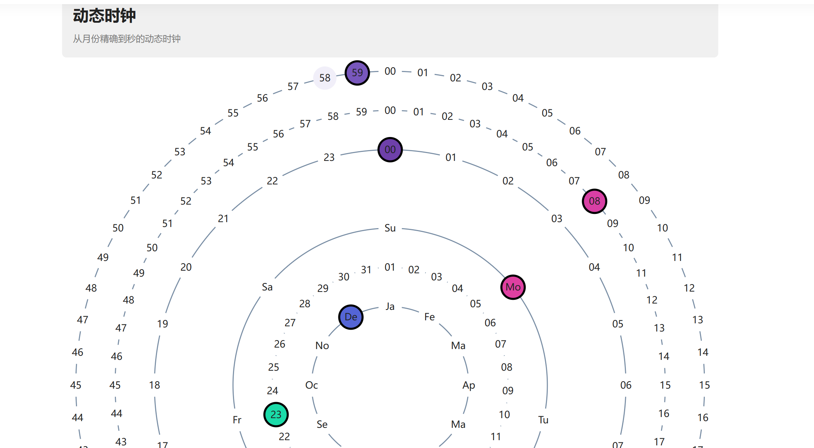

# 基于Yii框架搭建的博客系统

### 环境搭建

- PHP
    1. 访问 [PHP官方网站](https://windows.php.net/download/) 下载适合的PHP版本（线程安全版，选择 Zip 压缩包）。
    2. 解压到一个文件夹（例如：`C:\php`）。
    3. 配置环境变量：
  - 在系统的“环境变量”中添加 PHP 的路径（例如：`C:\php`）。
    4. 配置 `php.ini` 文件：
  - 将 `php.ini-development` 文件复制为 `php.ini`，根据需要进行配置（例如，启用扩展、设置时区等）。

- Mysql
    使用 MySQL Installer
    1. 访问 [MySQL官方网站](https://dev.mysql.com/downloads/installer/) 下载 MySQL Installer。
    2. 选择 **Windows (x86, 32-bit), MSI Installer** 版本。
    3. 运行下载的安装程序。
    4. 在安装过程中，选择 **Developer Default** 或 **Server only**，然后继续。
    5. 按照提示完成安装，并设置 MySQL root 用户的密码。
    6. 安装完成后，启动 MySQL 服务。
    7. 打开命令行工具，输入以下命令连接 MySQL：

        ```bash
        mysql -u root -p
        ```

    输入密码后即可登录 MySQL。

- yii2
        确保你的环境已经安装了以下软件：
  - **PHP**：Yii2 需要 PHP 5.4 或更高版本。
  - **Composer**：用于管理 PHP 项目的依赖。

     在 Windows 上安装 Composer
    1. 访问 [Composer官网](https://getcomposer.org/)。
    2. 下载并运行 Composer-Setup.exe，它会自动安装 Composer。
    3. 安装完成后，打开命令行，输入以下命令验证安装：

        ```bash
        composer --version

创建yii2项目
    1. 使用以下命令通过 Composer 创建 Yii2 项目：

    ```bash
    composer create-project --prefer-dist yiisoft/yii2-app-basic basic
    ```

    这将会在当前目录下创建一个名为 `basic` 的 Yii2 项目。如果你希望自定义项目名称，可以替换 `basic` 为其他名称。

    2. 进入项目目录：

    ```bash
    cd basic
    ```

    3. 运行 PHP 内置的开发服务器：

    ```bash
    php yii serve
    ```

    默认情况下，Yii2 开发服务器将在 `http://localhost:8080` 上运行。
        ```

- **集成环境--XAMPP**
如果觉得上述安装方法泰国麻烦可以尝试XAMPP安装
    1. 访问 [XAMPP 官方网站](https://www.apachefriends.org/index.html)。
    2. 下载适用于 Windows 的安装包。
    3. 运行下载的 `.exe` 文件启动安装程序。
    4. 在安装过程中，选择你需要安装的组件（默认情况下，Apache、MySQL、PHP、phpMyAdmin 等会被选中）。
    5. 选择安装路径（默认安装路径是 `C:\xampp`），点击 **Next**。
    6. 按照安装向导完成安装。
    7. 安装完成后，启动 XAMPP 控制面板。
    8. 在 XAMPP 控制面板中，点击 **Start** 启动 Apache 和 MySQL 服务。

 验证安装

1. 打开浏览器，输入 `http://localhost/`，如果显示 XAMPP 欢迎页面，说明 XAMPP 安装成功。
2. 访问 `http://localhost/phpmyadmin/`，可以打开 phpMyAdmin，验证 MySQL 服务是否正常

## （二）项目主要功能介绍

### **1.用户登录与注册功能**

 本系统设有安全可靠的用户登录与注册功能。为了确保用户的账户安全，系统采用密码哈希（Hash）存储方式，确保即使数据库被攻破，用户的密码也不会被泄露。用户可以通过注册邮箱进行身份验证，这不仅简化了用户的登录流程，还能有效防止身份冒用。同时，通过邮箱注册的用户在忘记密码时，系统也能提供便捷的找回密码功能，以增强用户体验。
 

 
 、

### 2.**后台管理功能**

 系统提供了强大的后台管理功能，使得具有管理员权限的用户（Root用户）可以高效管理平台上的各类内容。管理员可以对用户账户进行审核、禁用或删除，确保平台的安全和用户的合规使用。此外，管理员还可以管理帖子内容，包括编辑、删除以及审核用户发布的帖子。同时，系统支持对帖子和评论的点赞管理，管理员可以查看热门帖子和评论，促进用户间的互动和内容质量的提升。
      

### 3.**帖子管理功能**

 我们的帖子功能设计旨在增强用户之间的互动与交流。用户可以在平台上发布各类帖子，包括文字、图片和视频内容。每个帖子都支持评论功能，用户可以对帖子表达自己的看法或提出问题，促进讨论。此外，帖子还支持点赞功能，让用户能够快速表达对帖子内容的认可。通过这些功能，用户不仅能够分享信息，还能参与到社区的热烈讨论中，提升整体的用户参与感。
  

### 4.**留言功能**

 留言功能为用户提供了一个反馈和交流的渠道。在该功能中，用户可以在网站上发表留言，分享他们的看法和建议。用户还可以对网站进行打分，这为我们提供了宝贵的用户反馈信息。通过分析用户的留言和评分，我们可以更好地理解用户需求，及时调整和优化网站功能，提升用户体验。
 

### 5.**标签功能**

 为方便用户管理和查找信息，系统提供了标签功能。在用户发帖时，可以为帖子添加相关标签，以便于内容的分类和检索。当用户浏览帖子时，可以通过点击标签查看相应分类的帖子，从而快速找到自己感兴趣的内容。这一功能不仅提高了信息检索的效率，也丰富了用户的内容体验。
 

### 6.**数据可视化功能**

 我们通过使用JavaScript技术，实现了多种丰富的数据可视化功能。这些功能包括交互式的词云展示，能够直观地呈现平台上用户讨论的热门话题；对不同日期的月相计算，帮助用户了解天文现象；以及一个趣味性的可视化数字时钟，它不仅呈现时间信息，还通过动态效果增加了用户的视觉趣味。这些数据可视化功能不仅提升了网站的互动性，还增强了用户的参与感与趣味性。

 

 

